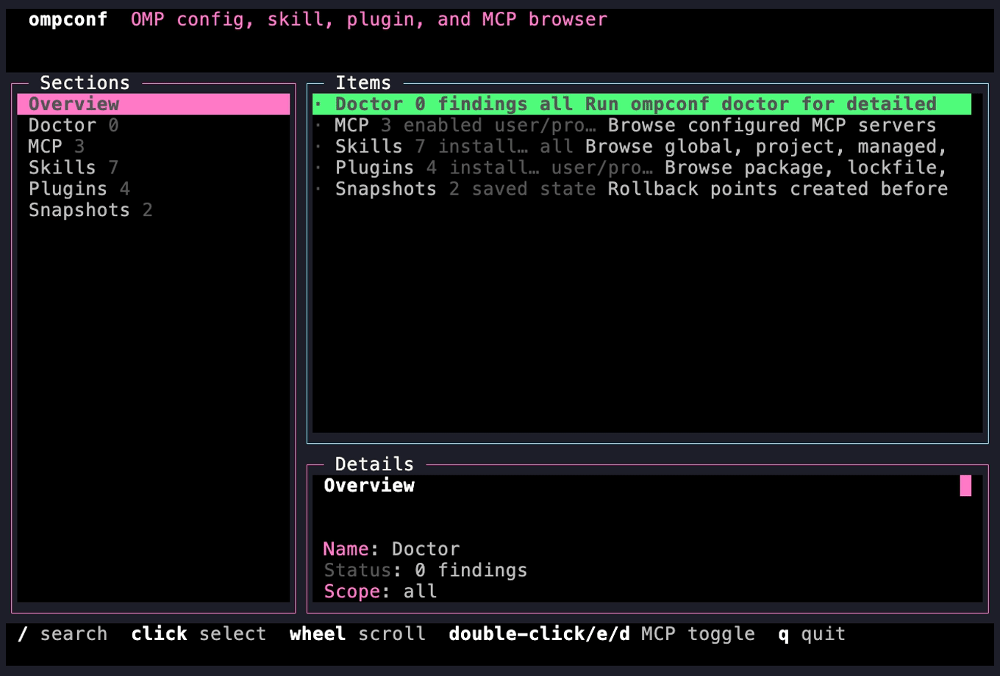
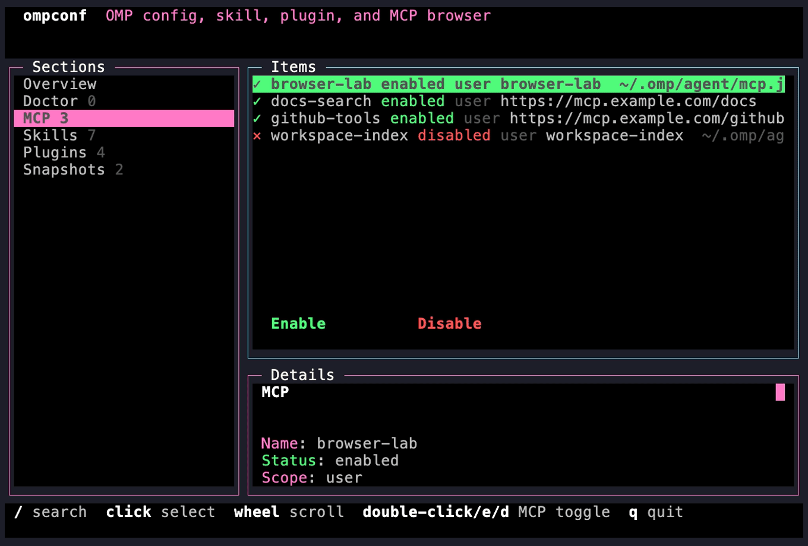
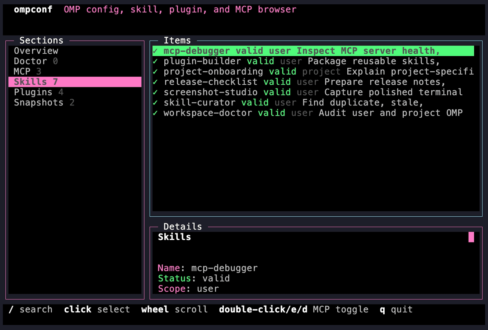
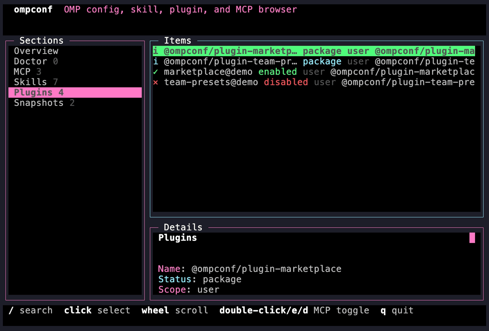
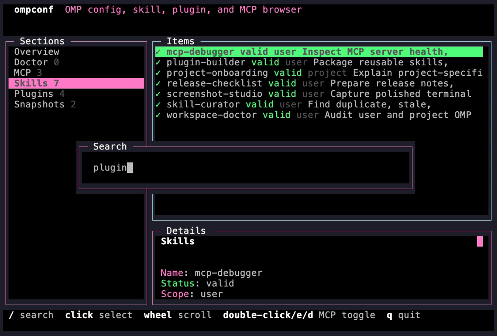

<div align="center">

# ompconf

**Browse, audit, and repair Oh My Pi config from one terminal UI.**

[](LICENSE)
[](https://bun.sh)
[](#quick-start)

</div>

`ompconf` is a standalone config manager for Oh My Pi users. It gives you a browser for MCP servers, skills, plugins, snapshots, and diagnostics without opening config files by hand.

<p align="center">
  
</p>

## Why use it?

| Need | What `ompconf` gives you |
| --- | --- |
| Understand an OMP setup | One overview of MCP servers, skills, plugins, snapshots, and diagnostics. |
| Inspect config safely | Read-only status, list, doctor, and TUI views with redaction by default. |
| Fix MCP state | Enable or disable MCP server entries through commands or the TUI. |
| Audit extension sprawl | Browse global, project, managed, and external skills with status markers. |
| Recover from config changes | Snapshot and rollback support before mutating operations. |

## Screenshots

All screenshots below use the sanitized demo fixture in `demo/fixtures`. They do not show a real user profile, private MCP URLs, local home paths, tokens, or personal infrastructure.

### MCP browser

<p align="center">
  
</p>

The MCP view shows server status, scope, transport summary, config path, and enable/disable actions. Mouse click, double-click, `e`, and `d` are wired to the same action path.

### Skills browser

<p align="center">
  
</p>

The skills view separates user and project skills, shows validity, and previews descriptions so duplicate or stale instruction packs are easier to spot.

### Plugin surfaces

<p align="center">
  
</p>

The plugins view combines package, lockfile, registry, and installed-plugin surfaces into one browseable list.

### Inline search

<p align="center">
  
</p>

Press `/` to search the current section without leaving the TUI. Normal navigation keys are blocked while the search box is focused, so text input does not accidentally move rows or toggle servers.

## Quick start

```bash
git clone https://github.com/wolfiesch/ompconf.git
cd ompconf
bun install
bun link
ompconf tui
```

Run read-only checks first:

```bash
ompconf status
ompconf doctor
ompconf list --kind skill
ompconf list --kind mcp
```

Use JSON when you want stable machine-readable output:

```bash
ompconf status --json
ompconf list --kind mcp --json
ompconf tui --render --screen mcp --query chrome
```

## TUI controls

| Control | Action |
| --- | --- |
| `/` | Search within the active section. |
| `j` / `k` or arrow keys | Move through rows. |
| `[` / `]` or Tab | Switch sections. |
| Mouse click | Select a row. |
| Mouse wheel | Scroll list or details panes. |
| Double-click, `e`, `d` | Toggle a selected MCP server when the row is actionable. |
| `q`, Esc, Ctrl-C | Quit. |

## Commands

| Command | Purpose |
| --- | --- |
| `ompconf status` | Show counts, active paths, and warnings. |
| `ompconf doctor` | Report diagnostics for MCPs, skills, plugins, and config files. |
| `ompconf list --kind <kind>` | List MCPs, skills, plugins, marketplaces, or all supported list surfaces. |
| `ompconf mcp <list|add|remove|enable|disable>` | Manage MCP config entries. |
| `ompconf skill ...` | Inspect and manage skills. |
| `ompconf snapshot` | Create rollback checkpoints. |
| `ompconf rollback` | Restore a prior snapshot. |
| `ompconf tui` | Open the interactive terminal browser. |

Global scoping flags keep demos, tests, and audits isolated:

```bash
ompconf status \
  --home demo/fixtures/home \
  --cwd demo/fixtures/home/workspace/example-project \
  --state-dir demo/fixtures/home/.ompconf
```

## Screenshot fixture

Regenerate the sanitized fixture:

```bash
bun scripts/generate-demo-fixture.js
```

Render a screenshot with VHS:

```bash
vhs demo/tapes/overview.tape
```

The fixture intentionally uses only `example.com` and local `~`-redacted paths. Do not use a live OMP home for marketing screenshots.

## Development

```bash
bun install
bun test
bun run check
```

Focused TUI checks:

```bash
bun test test/tui.test.ts test/tui-theme.test.ts
ompconf tui --render --screen mcp --query chrome
```

## Release safety

Before publishing screenshots or docs, scan the candidate assets for:

- absolute home paths such as `/Users/...` or `/home/...`
- real MCP URLs, internal hostnames, or infrastructure names
- tokens, API keys, cookies, credentials, or authorization headers
- live diagnostics from a personal profile

Use `demo/fixtures` for public material. Use your real `~/.omp` only for private debugging.

## License

MIT
